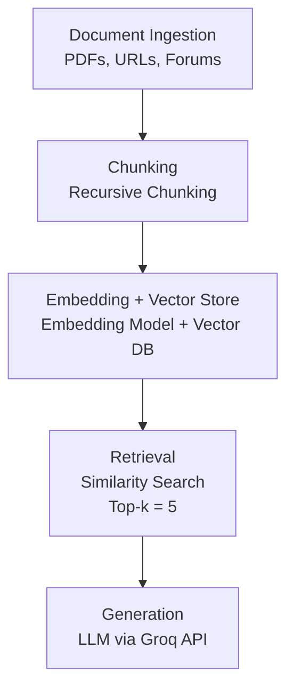

# Project 1 Planning: The Unofficial Guide

> Write this document before you write any pipeline code.
> Your spec and architecture diagram are what you'll use to direct AI tools (Claude, Copilot, etc.) to generate your implementation — the more specific they are, the more useful the generated code will be.
> Update the Retrieval Approach and Chunking Strategy sections if you change your approach during implementation.
> Update this file before starting any stretch features.

---

## Domain: Homeowner / Landlord Assistant

I chose this domain because my I am house-hacking. I want to develop a RAG system that I can use to reference and get guidance on certain scenarios that I face. I want to also make sure that my tenants feel safe and comfortable in their space so that we can all live harmoniously.

---

## Documents

<!-- List your specific sources: URLs, subreddit names, forum threads, or file descriptions.
     Aim for at least 10 sources that together cover different subtopics or perspectives within your domain. -->

| # | Source | Description | URL or location |
|---|--------|-------------|-----------------|
| 1 | Georgia DCA | Georgia Landlord-Tenant Handbook — comprehensive overview of GA residential landlord-tenant law | `documents/georgia_landlord_tenant_laws.md` |
| 2 | Federal Trade Commission | FTC guide for landlords on using consumer reports for tenant screening (FCRA compliance) | `documents/tenant_screening.md` |
| 3 | Fulton County Magistrate Court | Dispossessory (eviction) procedures and FAQ for Georgia landlords | `documents/eviction_process.md` |
| 4 | HUD | HUD Form HUD-9010G — official move-in/move-out inspection form | `documents/property_inspections.md` |
| 5 | ManageCasa | Landlord duty to repair and tenant maintenance request procedures | `documents/maintenance_requests.md` |
| 6 | Georgia Code Title 44 Ch. 7 | Security deposit rules under GA law — allowable deductions and return deadlines | `documents/security_deposits.md` |
| 7 | Landlord resource article | Finding, vetting, and contracting with reliable home-improvement contractors | `documents/contractor_management.md` |
| 8 | Property management resource | Rental property operating expenses, deductions, and IRS tax considerations | `documents/rental_property_finances.md` |
| 9 | Landlord resource guide | Emergency repair obligations — habitability emergencies and landlord response timelines | `documents/emergency_repairs.md` |
| 10 | Georgia lease template | Standard Georgia Residential Lease Agreement covering terms, disclosures, and signatures | `documents/lease_agreements.md` |

---

## Chunking Strategy

<!-- How will you split documents into chunks?
     State your chunk size (in tokens or characters), overlap size, and explain why those
     numbers fit the structure of your documents.
     A review-heavy corpus warrants different chunking than a long FAQ. -->

**Chunk size:** 1000 chars

**Overlap:** 200 chars

**Reasoning:** Recursive; splits on headings, subheadings, paragraphs, etc. befoere falling back to hard limits. Better than fixed because might split important concepts, and better than semantic because semantic is better for long, narrative content.

---

## Retrieval Approach

<!-- Which embedding model are you using (e.g., all-MiniLM-L6-v2 via sentence-transformers)?
     How many chunks will you retrieve per query (top-k)?
     If you were deploying this for real users and cost wasn't a constraint, what tradeoffs
     would you weigh in choosing a different embedding model — context length, multilingual
     support, accuracy on domain-specific text, latency? -->

**Embedding model:** `sentence-transformers` (`all-MiniLM-L6-v2`)

**Top-k:** 5 chunks

**Production tradeoff reflection:**
If cost were not a concern, I would evaluate larger models like `text-embedding-3-large` (OpenAI) or a domain-specific legal embedding model. Key tradeoffs to weigh: (1) **Context length** — `all-MiniLM-L6-v2` caps at 256 tokens, which can truncate longer legal clauses; larger models handle 512–8192 tokens and preserve full context. (2) **Domain accuracy** — general-purpose models underperform on legal terminology and statute citations; a model fine-tuned on legal corpora would produce tighter semantic matches. (3) **Multilingual support** — not a concern for this Georgia-specific English corpus, but relevant if tenants or documents were in other languages. (4) **Local vs. API latency** — the current local model adds no network round trips and keeps data private, while an API-hosted model introduces latency and sends query text to a third party. For a production landlord tool where legal accuracy matters, I would accept the latency and cost of an API-hosted, domain-specific model over the speed of a local general-purpose one.

---

## Evaluation Plan

| # | Question | Expected answer |
|---|----------|-----------------|
| 1 | **How long does a landlord have to return a security deposit in Georgia?** | *According to Georgia landlord-tenant law, a landlord must return the tenant's security deposit after the tenancy ends, minus any allowable deductions for damages beyond normal wear and tear. The landlord should also provide an itemized list of deductions if any amount is withheld.* |
| 2 | **What should I check before approving a rental applicant?** | *A landlord should verify income, review credit history, perform a background check, contact previous landlords, and ensure compliance with the Fair Credit Reporting Act (FCRA) when using consumer reports for screening.* |
| 3 | **What qualifies as an emergency repair in a rental property?** | *Emergency repairs typically involve issues that threaten health, safety, or property, such as burst pipes, major water leaks, loss of heat during winter, electrical hazards, or sewage backups. These situations generally require immediate or next-day response.* |
| 4 | **What should be included in a move-out inspection?** | *A move-out inspection should document the property's condition, compare it to the move-in inspection, identify damages beyond normal wear and tear, take photographs when appropriate, and record any issues that may justify deductions from the security deposit.* |
| 5 | **How can I avoid hiring a bad contractor?** | *Landlords should obtain multiple estimates, verify licenses and insurance, check references, and avoid contractors who demand full payment upfront, accept only cash, or ask the property owner to obtain permits on their behalf.* |

---

## Anticipated Challenges

<!-- What could go wrong? Name at least two specific risks with reasoning.
     Consider: noisy or inconsistent documents, missing source attribution, off-topic
     retrieval, chunks that split key information across boundaries. -->

1. Hallucinations/assumptions; system might say something is illegal but really isn't.

2. Retrieving the most relevant chunks; the retriever might give back information from the wrong section or document

3. Legal information might not be accurate and/or current

---

## Architecture

<!-- Draw a diagram of your pipeline showing the five stages:
     Document Ingestion → Chunking → Embedding + Vector Store → Retrieval → Generation
     Label each stage with the tool or library you're using.
     You can use ASCII art, a Mermaid diagram, or embed a sketch as an image.
     You'll use this diagram as context when prompting AI tools to implement each stage. -->

---

## AI Tool Plan

<!-- For each part of the pipeline below, describe:
     - Which AI tool you plan to use (Claude, Copilot, ChatGPT, etc.)
     - What you'll give it as input (which sections of this planning.md, which requirements)
     - What you expect it to produce
     - How you'll verify the output matches your spec

     "I'll use AI to help me code" is not a plan.
     "I'll give Claude my Chunking Strategy section and ask it to implement chunk_text()
     with my specified chunk size and overlap" is a plan. -->

**Milestone 3 — Ingestion and chunking:**

AI tool: Claude
Input: Documents section + Chunking Strategy section + architecture diagram from this file
Expected output: script that loads all .md files from /documents/, strips markdown artifacts, chunks with ~1000-char size / 200-char overlap using recursive splitting on headings/paragraphs
Verification: print 5 random chunks, confirm each is self-contained, within target length, and free of formatting artifacts

**Milestone 4 — Embedding and retrieval:**

AI tool: Claude
Input: Retrieval Approach section + pipeline diagram
Expected output: embed_and_store() using all-MiniLM-L6-v2 + ChromaDB with source filename metadata per chunk; retrieve(query, k=5) returning chunks + distance scores
Verification: run 3 evaluation queries, confirm top results are on-topic and distance scores below 0.5

**Milestone 5 — Generation and interface:**

AI tool: Claude
Input: grounding requirement (answers from retrieved context only, with source attribution), Groq model choice, Gradio skeleton structure
Expected output: prompt template enforcing context-only answers, Groq llama-3.3-70b-versatile integration, Gradio UI with question input + answer + sources output fields
Verification: test one in-scope query (confirms citation) and one out-of-scope query (confirms refusal, not hallucination)
